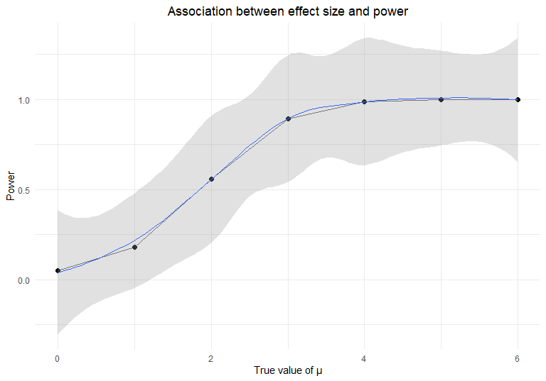

P8105\_hw5\_hy2669
================
haoyang,yi
2020/11/10

## Problem 1

### read and tidy the dataset

``` r
homicide_df = read_csv("data/homicide_data/homicide-data.csv") %>%
  mutate(city_state = str_c(city,state,sep = '_'),
         resolved = case_when(
           disposition == 'Closed without arrest' ~ "unsolved",
           disposition == 'Open/No arrest' ~ "unsolved",
           disposition == 'Closed by arrest' ~ "solved",
         )) %>%
  select(city_state,resolved) %>%
  filter(city_state != "Tulsa_AL") 
```

### summarize

``` r
aggregate_df = homicide_df %>%
  group_by(city_state) %>%
  summarize(hom_total = n(),
            hom_unsolved = sum(resolved == "unsolved"))
```

### obtain results of proportion tests

``` r
results_df = aggregate_df %>%
  mutate(prop_tests = map2(.x = hom_unsolved, .y = hom_total, ~prop.test(x = .x, n = .y)),
         tidy_tests = map(.x = prop_tests, ~broom::tidy(.x))) %>%
  select(-prop_tests) %>%
  unnest(tidy_tests) %>%
  select(city_state,estimate,conf.low,conf.high)
```

make plot

``` r
results_df %>%
  mutate(city_state = fct_reorder(city_state,estimate)) %>%
  ggplot(aes(x = city_state, y = estimate))+
  geom_point()+
  geom_errorbar(aes(ymin = conf.low, ymax = conf.high))+
  theme(axis.text.x = element_text(angle = 90, vjust = 0.5, hjust = 0.1))
```


## Problem 2

### read and tidy the data

``` r
file_name = list.files('./data/lda_data') # get the names of 20 csv.files
arm_df = tibble(file_name = file_name) %>% # start with a dataframe containing all file names.
  bind_cols(map_df(str_c('./data/lda_data/',file_name), read_csv)) %>% # read data from 20 csvs, save the results in arm_df.
  separate(file_name, into = c('arm_type', 'id')) # tidy the dataset, separate file_name(con01) into arm_type(con/exp) and id(1-10).
  knitr::kable(arm_df) # show the tidy dataset. Weekly observations are tidy.
```

| arm\_type | id | week\_1 | week\_2 | week\_3 | week\_4 | week\_5 | week\_6 | week\_7 | week\_8 |
| :-------- | :- | ------: | ------: | ------: | ------: | ------: | ------: | ------: | ------: |
| con       | 01 |    0.20 |  \-1.31 |    0.66 |    1.96 |    0.23 |    1.09 |    0.05 |    1.94 |
| con       | 02 |    1.13 |  \-0.88 |    1.07 |    0.17 |  \-0.83 |  \-0.31 |    1.58 |    0.44 |
| con       | 03 |    1.77 |    3.11 |    2.22 |    3.26 |    3.31 |    0.89 |    1.88 |    1.01 |
| con       | 04 |    1.04 |    3.66 |    1.22 |    2.33 |    1.47 |    2.70 |    1.87 |    1.66 |
| con       | 05 |    0.47 |  \-0.58 |  \-0.09 |  \-1.37 |  \-0.32 |  \-2.17 |    0.45 |    0.48 |
| con       | 06 |    2.37 |    2.50 |    1.59 |  \-0.16 |    2.08 |    3.07 |    0.78 |    2.35 |
| con       | 07 |    0.03 |    1.21 |    1.13 |    0.64 |    0.49 |  \-0.12 |  \-0.07 |    0.46 |
| con       | 08 |  \-0.08 |    1.42 |    0.09 |    0.36 |    1.18 |  \-1.16 |    0.33 |  \-0.44 |
| con       | 09 |    0.08 |    1.24 |    1.44 |    0.41 |    0.95 |    2.75 |    0.30 |    0.03 |
| con       | 10 |    2.14 |    1.15 |    2.52 |    3.44 |    4.26 |    0.97 |    2.73 |  \-0.53 |
| exp       | 01 |    3.05 |    3.67 |    4.84 |    5.80 |    6.33 |    5.46 |    6.38 |    5.91 |
| exp       | 02 |  \-0.84 |    2.63 |    1.64 |    2.58 |    1.24 |    2.32 |    3.11 |    3.78 |
| exp       | 03 |    2.15 |    2.08 |    1.82 |    2.84 |    3.36 |    3.61 |    3.37 |    3.74 |
| exp       | 04 |  \-0.62 |    2.54 |    3.78 |    2.73 |    4.49 |    5.82 |    6.00 |    6.49 |
| exp       | 05 |    0.70 |    3.33 |    5.34 |    5.57 |    6.90 |    6.66 |    6.24 |    6.95 |
| exp       | 06 |    3.73 |    4.08 |    5.40 |    6.41 |    4.87 |    6.09 |    7.66 |    5.83 |
| exp       | 07 |    1.18 |    2.35 |    1.23 |    1.17 |    2.02 |    1.61 |    3.13 |    4.88 |
| exp       | 08 |    1.37 |    1.43 |    1.84 |    3.60 |    3.80 |    4.72 |    4.68 |    5.70 |
| exp       | 09 |  \-0.40 |    1.08 |    2.66 |    2.70 |    2.80 |    2.64 |    3.51 |    3.27 |
| exp       | 10 |    1.09 |    2.80 |    2.80 |    4.30 |    2.25 |    6.57 |    6.09 |    4.64 |

### make a spaghetti plot

``` r
arm_df %>%
  pivot_longer(week_1:week_8,
               names_to = 'week',
               names_prefix = 'week_',
               values_to = 'observation') %>% # combine weekly observations in a column for making plot
  mutate(arm_id = str_c(arm_type,id)) %>% # combine arm_type and id again 
  group_by(arm_id) %>%
  ggplot(aes(x = week, y = observation, color = id, group = arm_id))+
  geom_line(alpha = 0.6)+
  geom_point(aes(shape = arm_type), alpha = 0.8, size = 2.5)+ # use aes(shape = ) to create points with distinct shape from two types of arm.
  labs(title = "Observations on each subject over time", x = "Week", y = "Observation")+
  theme(legend.position = "bottom", plot.title = element_text(hjust = .5))
```


Over the 8 weeks the observations of experiment group has a increasing
trend while observations of control groups stayed the same with little
fluctuations. After 8 weeks the observations of experiment group are
higher than control group in all 10 subjects

## Problem 3

### Create the function

``` r
set.seed(1)
norm_fun <- function(mu,n = 30, sigma = 5) # default setup: n = 30, sigma = 5
{
  sim_data = tibble(x = rnorm(n,mean = mu,sd = sigma),)
  sim_data %>%
    mutate(mu_hat = broom::tidy(t.test(sim_data))$estimate,
           p_value = broom::tidy(t.test(sim_data))$p.value,
            true_mean = mu) %>%
    select(-x) %>%
    distinct()
}
```

### Simulation for mu = 0,1,2,3,4,5,6

``` r
sim0_df = rerun(200,norm_fun(mu = 1)) %>%
  bind_rows() # Generate 5000 normal(mu = 0, sigma = 5, n = 30) simulation and store the results of t.test(H0 : mu = 0)

sim_df <- tibble(mu = c(0:6)) %>% # expand simulation to mu = 0,1,2,3,4,5,6
  mutate(output_list = map(.x = mu, ~rerun(100, norm_fun(mu = .x))),
         result_df = map(output_list,bind_rows)) %>%
  select(-output_list) %>%
  unnest(result_df) %>%
  mutate(Null_hypothesis = ifelse(p_value >= 0.05, "Fail to reject",'Reject'))  # Decision rule of t-test: If p_value < 0.05, reject H0, otherwise fail to reject H0
  head(sim_df)
```

    ## # A tibble: 6 x 5
    ##      mu mu_hat p_value true_mean Null_hypothesis
    ##   <int>  <dbl>   <dbl>     <int> <chr>          
    ## 1     0 -0.308   0.735         0 Fail to reject 
    ## 2     0  1.04    0.329         0 Fail to reject 
    ## 3     0 -0.696   0.379         0 Fail to reject 
    ## 4     0  0.133   0.913         0 Fail to reject 
    ## 5     0 -0.241   0.821         0 Fail to reject 
    ## 6     0 -0.600   0.490         0 Fail to reject

### Make a plot to show association between effect size and power.

``` r
sim_df %>%
  group_by(mu) %>%
  summarize(power = sum(Null_hypothesis == 'Reject')/n()) %>% # calculate power when mu = 0:6 
  ggplot(aes(x = mu, y = power))+
  geom_point(size = 2)+
  geom_line(alpha = 0.6)+
  geom_smooth(alpha = 0.3,size = 0.5)+
  labs( title = "Association between effect size and power",
        x = "True mu",
        y = "Power") +
  theme(plot.title = element_text(hjust = .5))
```


